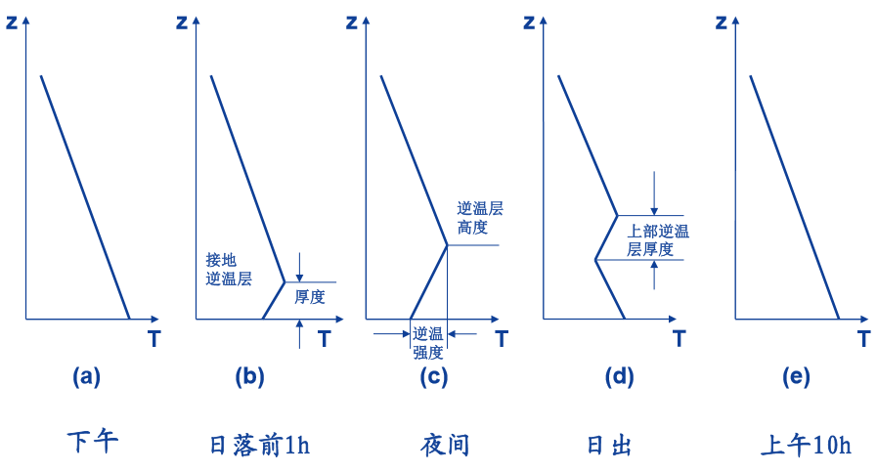

========================================================
大气中的逆温及其在T-InP图中的判别
========================================================
通常，对流层大气的温度随高度升高而降低，但有时候在某些层次会出现气温不随高度变化或随高度升高反而增加的现象。气象上把温度不随高度变化的大气层称为等温层，而把温度随高度升高而增加的大气层称为逆温层。就热力学角度而言，等温层和逆温层都是稳定层，表示大气层结稳定。如果它们出现在地面附近，则会限制近地气层强烈乱流的发生。如果它们形成于对流层某一高度之上，则会阻碍下方垂直运动的发展。由于逆温层对云雾、垂直运动发生发展以及其它天气现象影响较大，因此本节对各种逆温层的形成过程及其特点进行讨论。本节需要的基础知识和基本概念包括：绝热过程和非绝热过程、湿绝热过程，长波辐射和黑体、放射和吸收，混合层、行星边界层的结构、摩擦层、贴低层、近地层，湍流，比湿和绝对湿度，压高关系，平衡过程。

辐射逆温
^^^^^^^^^^^^^^^^^^^^^^
辐射逆温是晴空的夜间由于地面、雪面或冰面、云顶等的强烈的长波辐射冷却，使紧贴其上的气层与上层空气相比，有较大的降温而形成的。因此，辐射逆温通常从地面开始，逐渐向上发展形成逆温。但如果是由于云顶或雾顶辐射造成的辐射逆温，逆温层就始于云顶或雾顶附近。

形成辐射逆温的有利条件是：晴朗（或少云）而有微风（约2-3m/s）的夜晚。因为云层向地面放射长波辐射，能够减弱地面的有效辐射，不利于地面冷却。当地面风太大时，大气中的垂直混合作用太强，不利于近地层气层的冷却；无风时，冷却作用又不能扩散到较高的气层中去，也不利于逆温层的加厚；只有当风速适当时，才能使逆温层既有相当厚度又不至于因为湍流混合作用而遭到破坏。此外，还有其它一些因子影响辐射逆温的形成，见下表。

.. note::
	湿空气在辐射冷却过程中易发生凝结现象，如露，由于有潜热的释放，故不利于形成逆温

+----------+------------------------------+----------+----------+
|          | 因子类别                     | 有利因子 | 不利因子 |
+----------+------------------------------+----------+----------+
| 主要因子 | 风速                         | 微风     | 强风     |
+          +------------------------------+----------+----------+
|          | 黑夜持续时间                 | 长夜     | 短夜     |
+          +------------------------------+----------+----------+
|          | 干湿特征                     | 干空气   | 湿空气   |
+          +------------------------------+----------+----------+
|          | 天空状况                     | 晴空     | 有云     |
+----------+------------------------------+----------+----------+
| 其它因子 | 地表湿度                     |          |          |
+          +------------------------------+----------+----------+
|          | 植被类型                     |          |          |
+          +------------------------------+----------+----------+
|          | 地表类型（雪、沙地、草地等） |          |          |
+----------+------------------------------+----------+----------+

辐射逆温层的产生是有规律的，通常只在夜间形成，上午消失。下面以近地层的辐射逆温为例说明辐射逆温的生消过程。一般辐射逆温在日落前后自地面开始形成，地面因辐射冷却而降温，与地面接近的气层冷却降温最强烈，而上层的空气冷却降温缓慢。夜间随着辐射冷却的加强，逆温层逐渐加厚，黎明前达到最大厚度。日出后随着太阳短波辐射不断加热，地面温度上升，逆温自下而上逐渐消失，在上午完全消失，逆温层的厚度可以从几十米到300-400米，其上下界面温度差一般只有几度，很少能够达到10-15℃。这种逆温在中纬度大陆上都能发生，特别是沙漠地区经常出现。

	图 辐射逆温的生消过程

在冬季大陆上冷高控制的天气条件下，由于长时间的辐射冷却，地面和近地层的温度显著下降，可以形成白天也不消失的冬季辐射逆温。这种逆温层的厚度可达到几百米到2-3km，其上下界的温度差可以达到15-25℃，有时可以持续若干天不消失。

由于夜间云顶的辐射冷却作用比其上的空气强，所以在贴近较厚云层的大气层中也可以形成辐射逆温，但是这种逆温通常厚度不大，上下界的温差也很小。

在T-InP图上，典型辐射逆温的基本特征是：

1. 逆温始于地面，地面经常是T=Td或T~Td，这是因为逆温层下界与下垫面接触，湿度较大
2. 逆温层中温度廓线和露点廓线接近
3. Td几乎平行于等饱和比湿线，说明逆温层内空气混合充分，水汽垂直分布均匀
4. 逆温层顶以上T和Td迅速减小，由于层结稳定，阻碍水汽向上输送，湿度较小，因而T-Td大
   
.. figure:: _static/inversion/辐射逆温特征.png
	:align: center
	:scale: 50 %
	:alt: 辐射逆温特征示意图

	图 辐射逆温特征示意图

平流逆温
^^^^^^^^^^^^^^^^^^^^^^
当暖空气平流到冷的下垫面时，暖空气与冷地面之间不断的进行热量交换（湍流热量交换）。暖空气下层受冷的下垫面影响最大，降温强烈，形成一层浅薄的冷空气，而上层降温缓慢，从而形成逆温。

平流逆温的形成也是由地面开始逐渐向上扩散的，类似辐射逆温，但是它是基于空气的运动（平流）形成，而辐射逆温是局地形成的。其强弱由暖空气和冷地面之间的温差大小决定，温差越大，逆温越强。它可以在一天中的任何时刻出现，有的可以持续好几个昼夜。单纯的平流逆温没有明显的日变化。

冬季，在中纬度的沿海地区，由于海陆温差大，当海上暖湿空气流到大陆时，常出现较强的平流逆温。这种逆温常伴随着平流雾的形成。与辐射逆温不同，出现平流雾时，不但不要求晴朗少云，而且风速也可以很大（可达5-8m/s）。

.. note::
	平流逆温的天气学意义就在于它与平流雾的形成有关。

暖空气经冰、雪表面产生融冰、融雪现象，吸收一部分热量，使得平流逆温得到加强，这种逆温称为“雪面逆温”。

在T-InP图上，平流逆温非常浅薄，只有数米或几十米。

湍流逆温
^^^^^^^^^^^^^^^^^^^^^^^
湍流逆温是由于低层（摩擦层，也叫行星边界层）空气的湍流混合，在湍流层顶部所形成的逆温。

.. note::
	摩擦层又称行星边界层，底部和地表接触，上界大致为1-2km高度。

在摩擦层内部的未饱和空气（温度直减率 γ ），经过湍流混合后，温度直减率趋近于干绝热线 γd，湍流混合区顶部的降温十分显著。在湍流混合区和自由大气之间的过渡层内，由于湍流随高度迅速减弱，降温作用随高度迅速减弱。到了自由大气，降温作用不明显。所以上述过渡层内，温度直减率必然变小，强的可达逆温程度。

湍流逆温的形成过程见下图：假定在湍流混合前，层结曲线为ABC，此时 γ < γd，层结稳定。因为未饱和湿空气在绝热升降过程中温度是按照干绝热递减率变化的，所以当湍流在混合层内发生时，上层的空气沿着干绝热线下降到下层（F->E），其温度要比周围的空气高（TE > TA），混合后下层温度升高（TA' > TA）。而下层空气沿着干绝热线上升到上层（A->D），其温度低于周围空气的温度（TD < TF），经过混合后上层温度降低（TF' < TF）。因此，经过充分混合后，湍流混合层内的层结曲线趋向于干绝热线（A'F'），γ ≈ γd。在摩擦层与自由大气之间的过渡层内，湍流急剧减弱，温度递减率陡然变小，出现逆温（F'B）。

.. figure:: _static/inversion/湍流逆温形成示意图.png
	:align: center
	:scale: 60%
	:alt: 湍流逆温形成示意图

	图 湍流逆温形成示意图

.. note::
	湍流逆温的天气学意义1：风速越大，湍流越强。冷空气过境后风速增大，湍流引起的地面增温可显著减小因平流引起的降温（冷空气降温）。在冷平流不太强的情况下，甚至会出现温度不降反升的现象。这种情况在北京经常出现。

因湍流逆温出现在湍流混合层的顶部，所以其离地的高度随湍流层的厚薄而定。湍流强时，湍流厚度厚，它所在的高度就高。反之，高度就低。一般它都位于摩擦层的中上部，不紧贴地面。湍流逆温的厚度不大，一般不超过几十米。从湿度的垂直分布来看，逆温层以下，经过强烈的湍流混合后，气层中水汽的垂直分布已经比较均匀。因此，在T-InP图中，逆温层以下露点温度的垂直分布曲线大致平行于等饱和比湿线，因为在没有凝结的情况下，比湿不变，充分混合后导致比湿上下相等。水汽从逆温层上界开始急剧减少，逆温层高度大致与摩擦层顶相吻合，离地大约1km。

.. note::
	湍流逆温的天气学意义2：在逆温层的底部，由于下层的随其和杂质向上输送，以及温度的下降，容易发生层云和层积云。

湍流逆温在T-InP图中基本特征可以归纳为：

1. 逆温层位于行星边界层内，但不到达地面
2. 逆温层下方的温度递减率接近干绝热递减率
3. 逆温层下方的露点廓线与等饱和比湿线接近平行
4. 边界层内风速较大

.. figure:: _static/inversion/湍流逆温特征.png
	:align: center
	:scale: 70%
	:alt: 湍流逆温特征示意图

	图 湍流逆温特征示意图

下沉逆温
^^^^^^^^^^^^^^^^^^^^^^^
由于稳定气层整层空气下沉压缩，绝热增温而形成的逆温。形成过程如下图所示，ABCD为某高度上的气层，厚度为 Δz，当气层下沉时，它的压力逐渐增大，厚度减小，图中 Δz' < Δz 。假如下沉过程是绝热的，而且气层内部相对位置不变，即原来在顶（底）部的空气下沉后仍在顶（底）部。由于顶部（DC）下沉的距离（DC->D'C'）大于底部下沉的距离（AB->A'B'），所以顶部绝热增温的幅度大于底部。因此，当气层下沉带某一高度时，气层顶部的气温高于底部，变形成逆温。

.. figure:: _static/inversion/下沉逆温形成示意图.png
	:align: center
	:alt: 下沉逆温形成示意图

	图 下沉逆温形成示意图，左图示意气层下沉后厚度和截面积的变化，右图显示原先ABCD气层的垂直温度递减率为 :math:`\gamma （\gamma_s < \gamma < \gamma_d）` ，下沉至A'B'C'D'后， :math:`\gamma （\gamma < \gamma_s）` ，出现逆温

下沉逆温形成的有利天气条件是：极地冷高压或者副热带高压控制下的晴好天气，高压中有持久而强盛的下沉运动。

下沉逆温的特点是:

1. 出现在空中一定的高度上，不及地（距地1-2km以上），范围广，逆温层厚度大（可达数千米），逆温持续时间长
2. 在逆温层中空气比较干燥，温度露点差很大，在T-InP图上表现为露点曲线与层结曲线的距离随着高度升高加大，形成通常所说的喇叭口

.. figure:: _static/inversion/下沉逆温特征.png
	:align: center
	:scale: 80%
	:alt: 下沉逆温特征示意图

	图 下沉逆温特征示意图

.. note::
	**湍流逆温和下沉逆温的比较**

	1. 下沉逆温在边界层之上，湍流逆温在边界层中
	2. 下沉逆温厚，而湍流逆温薄
	3. 湍流逆温也是喇叭口形，但是湍流逆温层下的层结曲线是接近干绝热线，湿度是接近等饱和比湿线，而下沉逆温没有这个限制
	4. 下沉逆温底部不易产生云，而湍流逆温底部容易有云

锋面逆温
^^^^^^^^^^^^^^^^^^^^^^
锋面逆温时由于锋面上方的暖气团凌驾于冷气团之上，冷暖气团的温度差异而形成锋区内的逆温，锋区的厚度就是逆温层的厚度，它的高度随着锋面的倾斜而成倾斜状态。由于锋是从地面向冷空气方向倾斜的。因此，锋面逆温只能在冷气团控制的地区观测到，锋面逆温离地的高度与观测点相对于锋面的位置有关，距离地面锋线越近，逆温层高度越低，反之越高。

.. figure:: _static/inversion/锋面逆温示意图.png
	:align: center
	:scale: 70%
	:alt: 锋面逆温示意图

	图 锋面逆温的垂直剖面图，右图为A点所在位置的探空

锋面逆温在T－lnP图中的基本特征：

1. 一般暖气团中的湿度比冷气团大一些，所以湿度与温度同时随着高度的升高而增加
2. 由于锋上暖气团中常有上升运动，因此逆温层上方的温度露点差一般比下方冷气团中的要小，当锋面上有凝结现象时，逆温层以上的温度露点差可以为零。在T-InP图上表现为逆温层以上，露点曲线与层结曲线比较接近。

.. figure:: _static/inversion/锋面逆温特征.png
	:align: center
	:scale: 60%
	:alt: 锋面逆温特征示意图

	图 锋面逆温特征示意图

地形逆温
^^^^^^^^^^^^^^^^^^^^^^
地形逆温多发生在山谷或盆地等低洼地区。夜晚，山坡上的近地面空气辐射冷却，因冷空气较重，沿斜坡下沉流入低洼地区，聚集在山谷盘地底部，使原来较暖的空气受挤抬升，出现温度倒置现象。

小结
^^^^^^^^^^^^^^^
以上六种逆温由于气形成的机理不同，它们出现的高度和时间以及逆温层上下方的温度廓线和露点廓线都有各自的特点，因此不难把它们区分开来，并通过它们推测大气中所发生的动力学和热力学过程。这正是分析逆温层的意义所在。当然实际情况有时候可能不想上面所说的那么典型，常常实际中原因混杂在一起，使得逆温层性质不易判断。在这种情况下，我们应该更具逆温层出现的时间、地点和天气条件等加以具体分析，抓住其主要特点，从而做出正确分析。
